# 🤖 AI Employee Management System

An AI-powered Employee Management System developed using **Flask**, **Machine Learning**, and **Deep Learning**. The system helps organizations manage employee information while providing intelligent predictions and analytics.

---

## 🚀 Features

- 🔐 Employee Login

- 👤 Employee Profile Management
- 📝 Attendance Management
- 📅 Leave Request & Approval
- 💰 Salary Management
- 📊 Performance Prediction
- 📈 Promotion Prediction
- 👥 Employee Clustering
- 🧠 Employee Attrition Prediction (ANN)
- 🚨 Employee Anomaly Detection (Autoencoder)
- 📅 Future Attendance Prediction (LSTM)
- 💬 Employee Feedback Sentiment Analysis (BERT)

---

## 🛠️ Technologies Used

### Frontend
- HTML5
- CSS3
- Bootstrap
- JavaScript

### Backend
- Python
- Flask

### Machine Learning
- Scikit-learn
- Pandas
- NumPy
- Joblib

### Deep Learning
- TensorFlow
- Keras
- ANN
- Autoencoder
- LSTM
- BERT

### Database
- SQLite

---

## 📂 Project Structure

```
AI-Employee-management-system/
│── app.py
│── database.py
│── dataset/
│── templates/
│── static/
│── train_attrition_ann.py
│── train_autoencoder.py
│── train_bert.py
│── train_lstm.py
│── README.md
│── .gitignore
```

---

## ⚙️ Installation

Clone the repository:

```bash
git clone https://github.com/parameshwari228/AI-Employee-management-system.git
```

Go to the project folder:

```bash
cd AI-Employee-management-system
```

Install the required packages:

```bash
pip install flask pandas numpy scikit-learn tensorflow nltk joblib
```

Run the application:

```bash
python app.py
```

Open your browser:

```
http://127.0.0.1:5000
```

---

## 📊 AI Modules

- Employee Attrition Prediction (ANN)
- Employee Anomaly Detection (Autoencoder)
- Future Attendance Prediction (LSTM)
- Employee Feedback Sentiment Analysis (BERT)

---

## 📸 Screenshots

Add screenshots of:
- Login Page
- Dashboard
- Attendance
- Leave Management
- Prediction Pages

---

## 👩‍💻 Author

**Parameshwari G**

GitHub: https://github.com/parameshwari228

---

## ⭐ Support

If you found this project helpful, please consider giving it a ⭐ on GitHub.
# 📸 Application Screenshots

## 🔐 Login Page
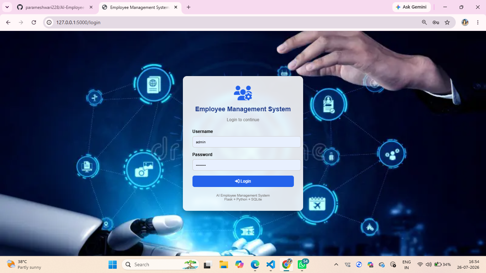

## 🏠 Dashboard
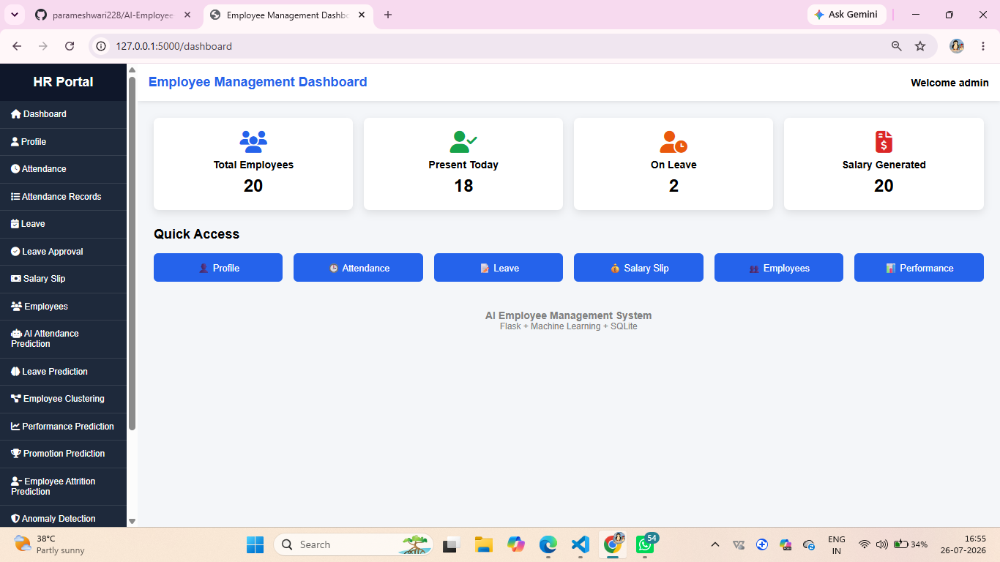

## 👤 Employee Profile
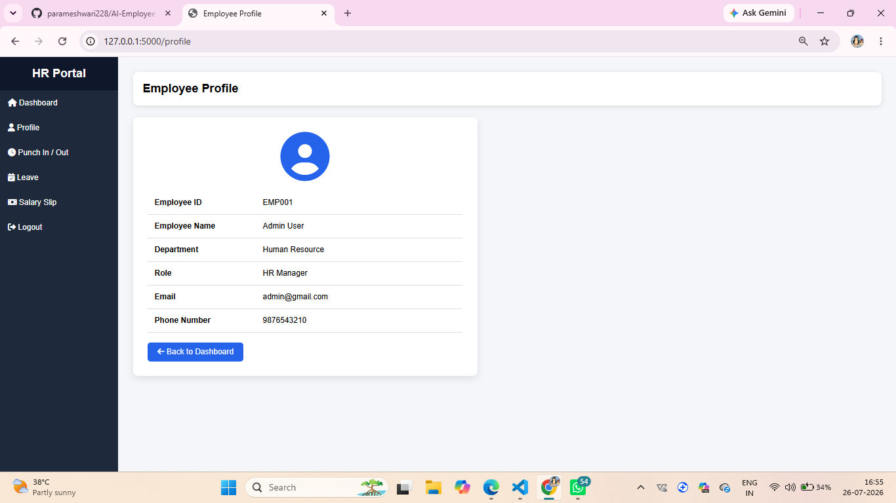

## 👥 Employee List
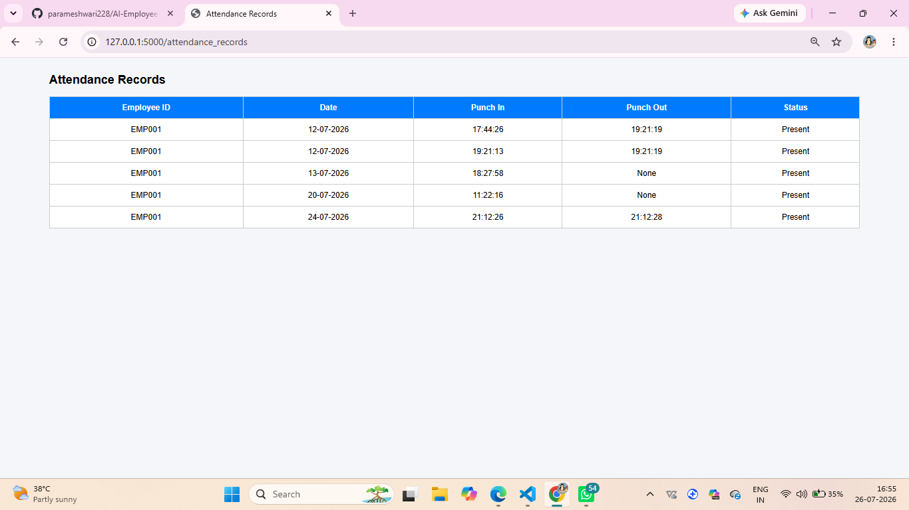

## 🕒 Punch In / Punch Out
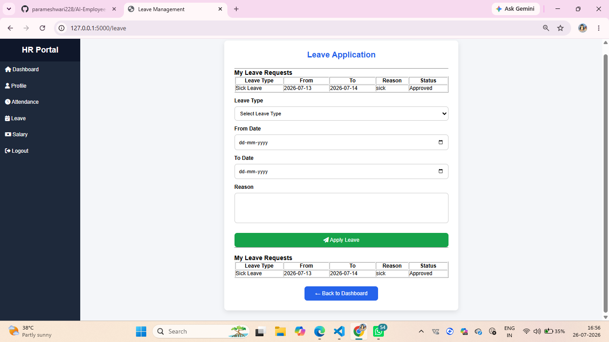

## ✅ Leave Approval


## 📝 Leave Request
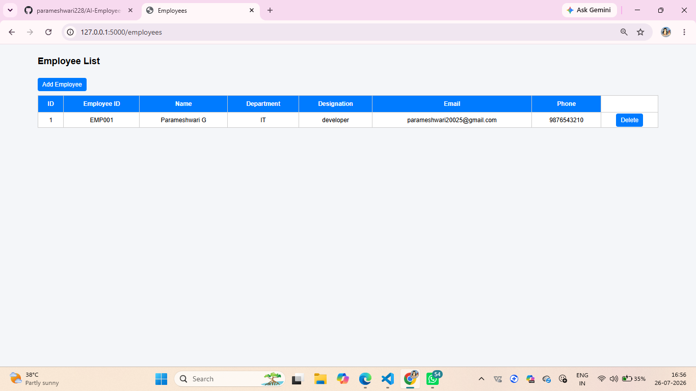

## 📋 Leave Approval Dashboard
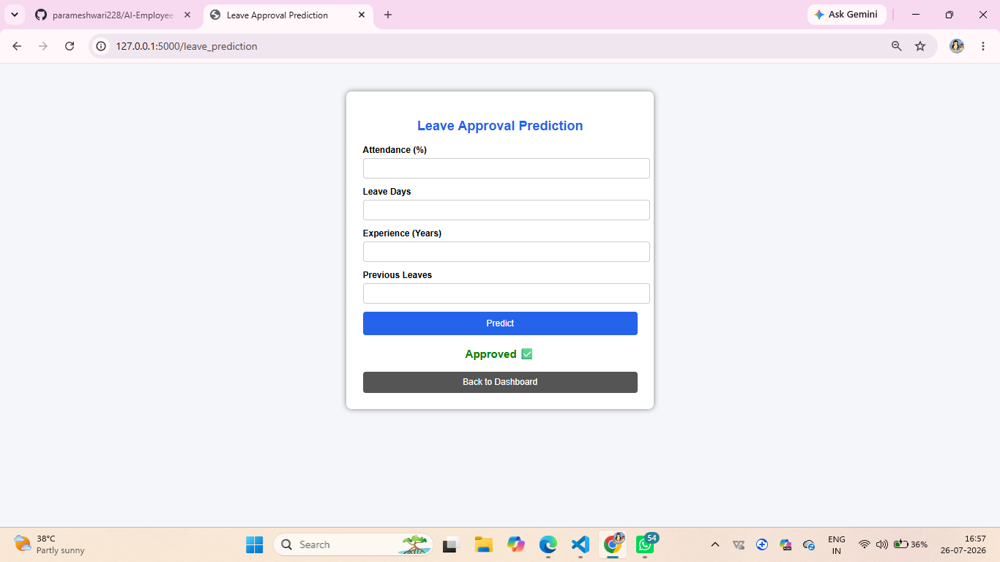

## 📅 Attendance Prediction
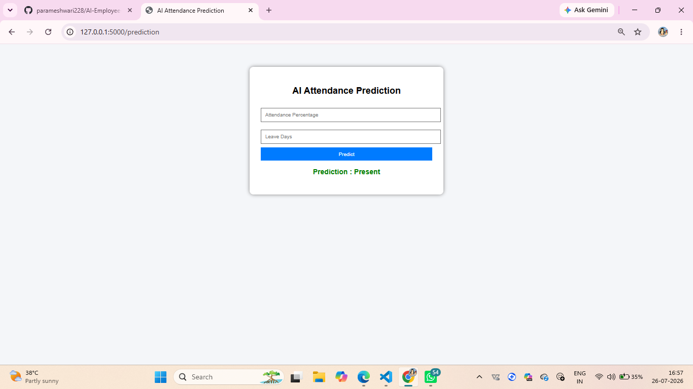

## 💰 Salary Management
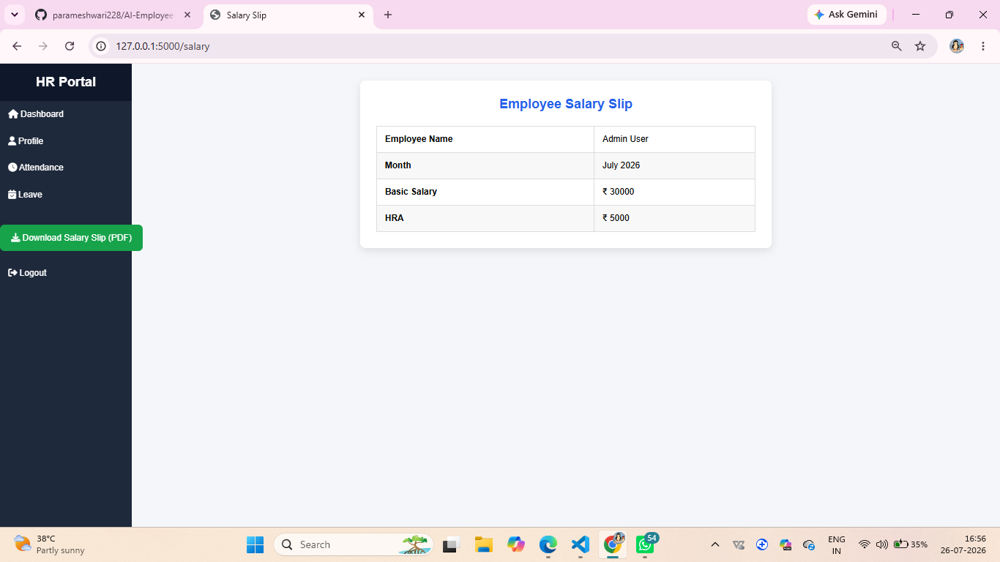

## 👥 Employee Clustering
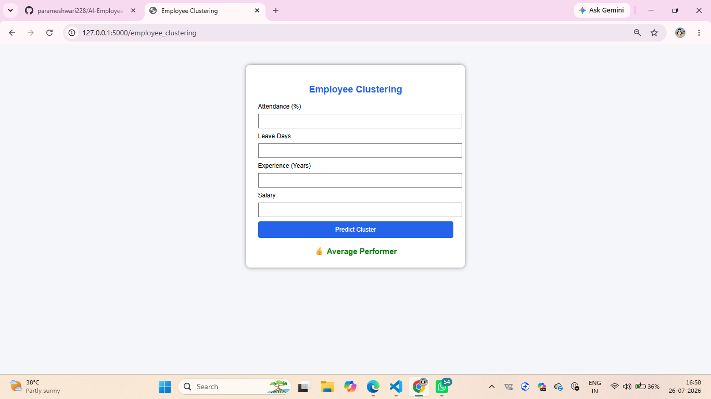

## 📈 Performance Prediction
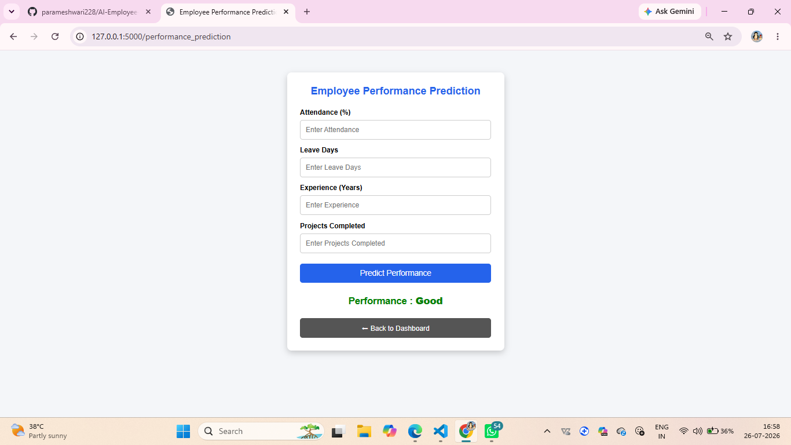

## 🚀 Promotion Prediction
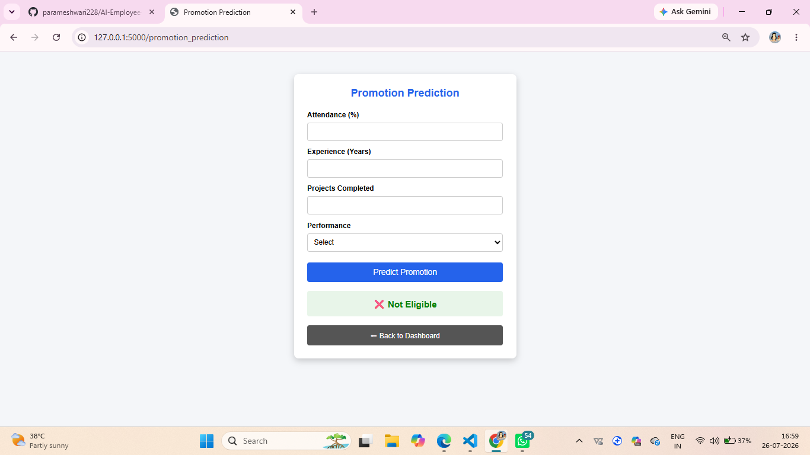

## 🚨 Anomaly Detection
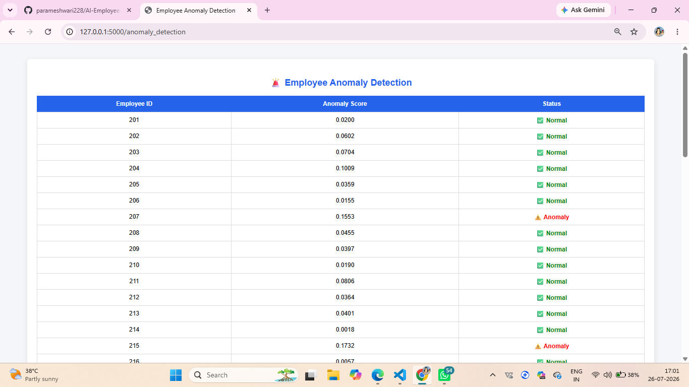

## 📅 Future Attendance Prediction
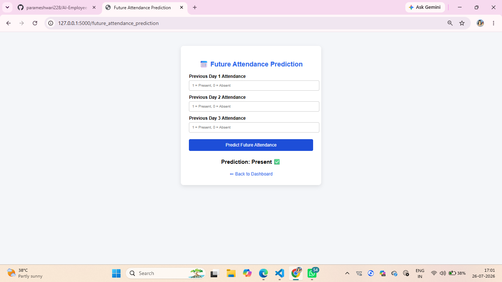

## 💬 Feedback Sentiment Analysis
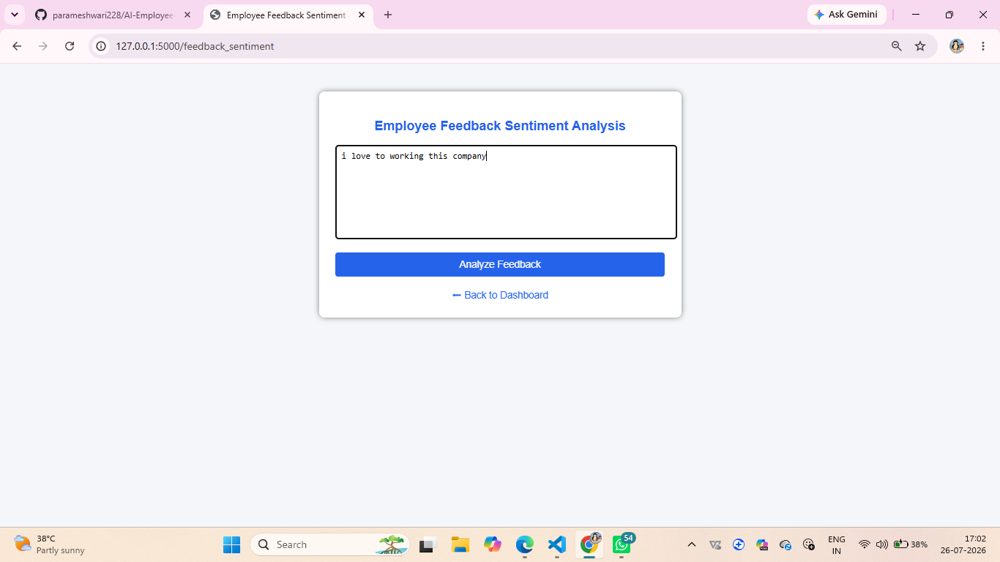

## 🤖 Prediction Dashboard
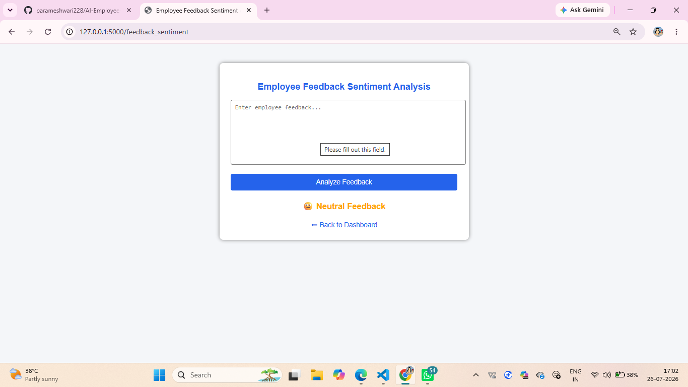